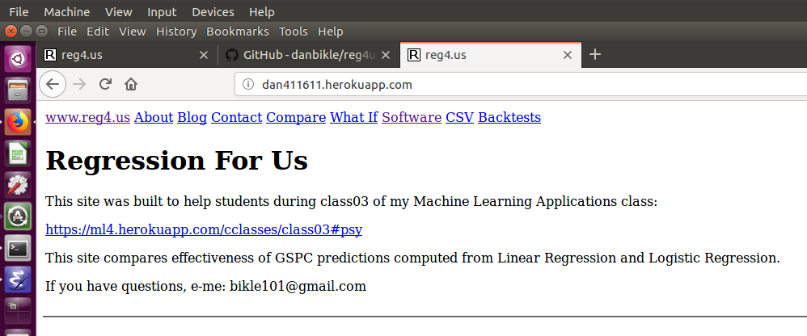
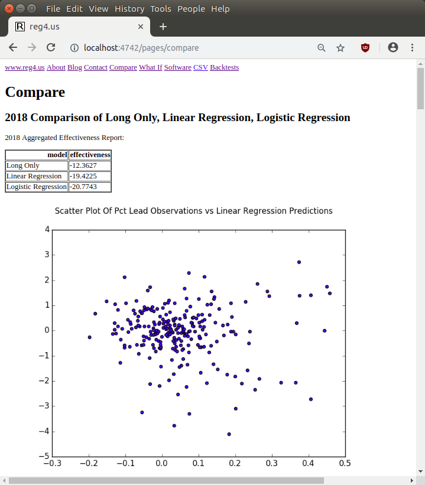
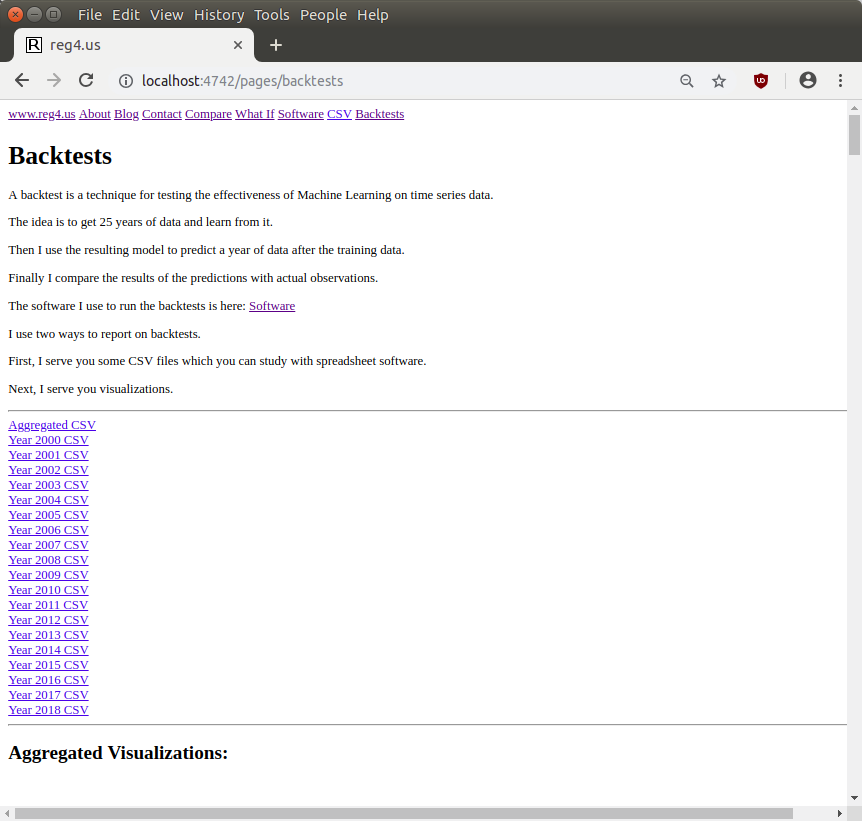
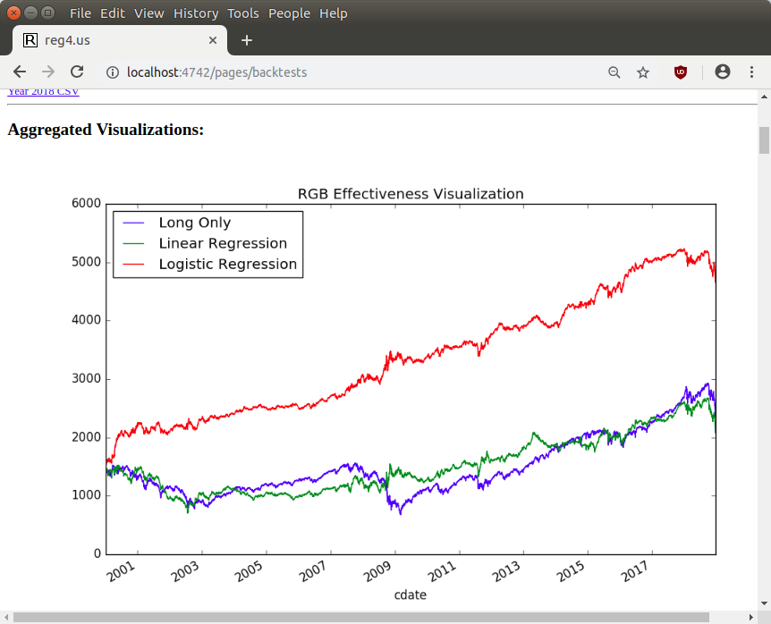

# README.md

# Deployment [ Laptop ]

I deployed this repo to my laptop with the steps listed below:

* I installed Virtualbox software which I downloaded from this URL:
* https://www.virtualbox.org/wiki/Downloads
* I downloaded and imported an Ubuntu 16 appliance [ub16_2018_0206.ova]: 
* https://drive.google.com/file/d/10p1W7kqzxE69jODhUzcb-qi-osN4htO-
* After import I logged into the ann account on the appliance with passwd: "a"
* I used a shell command to create an account named reg4us:
```
sudo useradd -m -s /bin/bash -G sudo reg4us
sudo passwd reg4us
```
* I logged out of the ann account.
* I logged into the reg4us account.
* I used shell commands to install Anaconda Python:
```
cd ~reg4us
echo 'export PATH=${HOME}/anaconda3/bin:$PATH' >> ~reg4us/.bashrc
wget https://repo.continuum.io/archive/Anaconda3-4.2.0-Linux-x86_64.sh
bash Anaconda3-4.2.0-Linux-x86_64.sh -b
mv ~reg4us/anaconda3/bin/curl ~reg4us/anaconda3/bin/curl_ana
```
* I used shell commands to install Rails:
```
cd ~reg4us
cp ~ann/.gitconfig ~reg4us/
wget ml4.herokuapp.com/.gemrc
echo 'export PATH="${HOME}/.rbenv/bin:$PATH"' >> ~reg4us/.bashrc
echo 'eval "$(rbenv init -)"' >> ~reg4us/.bashrc
git clone https://github.com/rbenv/rbenv.git      .rbenv
git clone https://github.com/rbenv/ruby-build.git .rbenv/plugins/ruby-build
bash
rbenv install 2.5.3
rbenv global  2.5.3
gem install rails -v 5.2.2
```
* I cloned the reg4us repo:
```
cd ~reg4us
git clone https://github.com/danbikle/reg4us
```
* I called bundler:
```
cd ~reg4us/reg4us
bundle
```
* I started the local webserver with a simple shell script:
```
~reg4us/reg4us/script/railss.bash
```
* I loaded the home page from the webserver into my browser:
```
localhost:4742
```


# Deployment [ Heroku ]

* Next, I created an account at heroku.com:
* https://signup.heroku.com/
* Next, on my laptop, I installed the Heroku client:
```
cd ~reg4us
wget https://cli-assets.heroku.com/heroku-cli/channels/stable/heroku-cli-linux-x64.tar.gz
tar xf heroku-cli-linux-x64.tar.gz
mv heroku*linux-x64 heroku
echo 'export PATH=${HOME}/heroku/bin:$PATH' >> ~/.bashrc
bash
heroku auth:login
heroku status
```
* Next, I deployed the app to heroku:
```
cd ~reg4us/reg4us
heroku create dan411611 # needs to be unique!
git push heroku master
```
* I saw this in my browser:


# Operation [ Manual ]

* Manual operation can be summarized:
* Run scripts on the laptop which then change files in the repo.
* Study the changed files using both editor and browser.
* Push the changed files to Heroku for the public.

# curlprices.bash

* The script, curlprices.bash, gets prices from the web.
* I rarely call curlprices.bash directly but other scripts call it frequently.
* When I manually operate curlprices.bash, I should see output like this:
```
reg42@ub100:~/reg4us/script$ cd ~/reg4us/script
reg42@ub100:~/reg4us/script$ ll
total 64
drwxrwxr-x  2 reg42 reg42 4096 Dec 25 13:41 ./
drwxrwxr-x 15 reg42 reg42 4096 Dec 25 13:43 ../
-rwxr--r--  1 reg42 reg42 1723 Dec 24 12:57 backtest.bash*
-rw-rw-r--  1 reg42 reg42 2437 Dec 23 17:17 backtest_rgb.py
-rw-rw-r--  1 reg42 reg42 1176 Dec 23 13:20 backtest_rpt.py
-rw-rw-r--  1 reg42 reg42  369 Dec 24 16:03 crontab_calif.txt
-rwxrwxr-x  1 reg42 reg42  386 Dec 24 14:09 curlprices.bash*
-rw-rw-r--  1 reg42 reg42 2283 Dec 23 20:45 genf.py
-rw-rw-r--  1 reg42 reg42 6139 Dec 23 20:59 learn_tst_rpt.py
-rwxr--r--  1 reg42 reg42  891 Dec 25 13:41 night.bash*
-rwxrwxr-x  1 reg42 reg42  345 Dec 24 15:24 night_pull_push.bash*
-rwxr--r--  1 reg42 reg42  262 Dec 23 18:00 railss.bash*
-rwxrwxr-x  1 reg42 reg42 1759 Dec 24 13:42 whatif.bash*
-rw-rw-r--  1 reg42 reg42 1490 Dec 24 06:11 whatif.py
-rw-rw-r--  1 reg42 reg42 1135 Dec 24 13:29 whatif_rpt.py
reg42@ub100:~/reg4us/script$ 
reg42@ub100:~/reg4us/script$ 
reg42@ub100:~/reg4us/script$ ./curlprices.bash 
  % Total    % Received % Xferd  Average Speed   Time    Time     Time  Current
                                 Dload  Upload   Total   Spent    Left  Speed
100 1272k  100 1272k    0     0  1158k      0  0:00:01  0:00:01 --:--:-- 1158k
reg42@ub100:~/reg4us/script$ 
reg42@ub100:~/reg4us/script$ 
reg42@ub100:~/reg4us/script$ 
reg42@ub100:~/reg4us/script$ tail ~/reg4us/public/csv/gspc2.csv
2018-12-11,2636.780029
2018-12-12,2651.070068
2018-12-13,2650.540039
2018-12-14,2599.949951
2018-12-17,2545.939941
2018-12-18,2546.159912
2018-12-19,2506.959961
2018-12-20,2467.419922
2018-12-21,2416.620117
2018-12-24,2351.100098
reg42@ub100:~/reg4us/script$ 
reg42@ub100:~/reg4us/script$ 
reg42@ub100:~/reg4us/script$ 
```

# whatif.bash

* The script, whatif.bash, helps me understand some whatif-scenarios.
* It generates predictions for various price points.
* The price points are "what-if" closing prices of the next trading day.
* I ran whatif.bash after 2018-12-24 market-close and captured output.
* The predictions displayed below are strongly bullish.
* The first Linear Regression prediction is near 0.48 which is 10x more bullish than a typical prediction.
* The first Logistic Regression prediction is near 0.62 which is 24% above the 0.5 decision boundry.
* Both predictions are focused on percent delta of price rather than price itself:
```
reg42@ub100:~/reg4us/script$ ./whatif.bash 
  % Total    % Received % Xferd  Average Speed   Time    Time     Time  Current
                                 Dload  Upload   Total   Spent    Left  Speed
100 1272k  100 1272k    0     0  1173k      0  0:00:01  0:00:01 --:--:-- 1173k
-1.0
2018
-0.8
2018
-0.6
2018
-0.4
2018
-0.2
2018
0.0
2018
0.2
2018
0.4
2018
0.6
2018
0.8
2018
1.0
2018
Whatif_Price,Linear Regression Prediction,Logistic Regression Prediction
2327.589100,0.480291,0.621723
2332.291300,0.468104,0.618799
2336.993500,0.455918,0.615875
2341.695700,0.443781,0.612944
2346.397900,0.431641,0.610011
2351.100100,0.419508,0.607071
2355.802300,0.407450,0.604138
2360.504500,0.395365,0.601197
2365.206700,0.383292,0.598244
2369.908900,0.371253,0.595298
2374.611100,0.359214,0.592346
reg42@ub100:~/reg4us/script$
reg42@ub100:~/reg4us/script$
reg42@ub100:~/reg4us/script$
```

* If the webserver is running locally, it should serve visualizations from whatif.bash:


* The public should see the visualizations at this URL:
https://reg4.herokuapp.com/pages/whatif


# night.bash

* The script, night.bash, generates predictions for the most recent closing price.
* I should note that night.bash calls both curlprices.bash and whatif.bash.
* I ran night.bash on 2018-12-25 and captured output:
```
reg42@ub100:~/reg4us/script$ ./night.bash 
  % Total    % Received % Xferd  Average Speed   Time    Time     Time  Current
                                 Dload  Upload   Total   Spent    Left  Speed
100 1272k  100 1272k    0     0  44619      0  0:00:29  0:00:29 --:--:--  345k
-1.0
2018
-0.8
2018
-0.6
2018
-0.4
2018
-0.2
2018
0.0
2018
0.2
2018
0.4
2018
0.6
2018
0.8
2018
1.0
2018
Whatif_Price,Linear Regression Prediction,Logistic Regression Prediction
2327.589100,0.480291,0.621723
2332.291300,0.468104,0.618799
2336.993500,0.455918,0.615875
2341.695700,0.443781,0.612944
2346.397900,0.431641,0.610011
2351.100100,0.419508,0.607071
2355.802300,0.407450,0.604138
2360.504500,0.395365,0.601197
2365.206700,0.383292,0.598244
2369.908900,0.371253,0.595298
2374.611100,0.359214,0.592346
  % Total    % Received % Xferd  Average Speed   Time    Time     Time  Current
                                 Dload  Upload   Total   Spent    Left  Speed
100 1272k  100 1272k    0     0  1152k      0  0:00:01  0:00:01 --:--:-- 1158k
Long-Only-Effectiveness:
-12.362700000000002
Linear-Regression-Effectiveness:
-19.4225
Logistic-Regression-Effectiveness:
-20.774299999999997
reg42@ub100:~/reg4us/script$ 
reg42@ub100:~/reg4us/script$ 
reg42@ub100:~/reg4us/script$
```

* If the webserver is running locally, it should serve visualizations from night.bash:


* The public should see the visualizations at this URL:
https://reg4.herokuapp.com/pages/compare
* At the end of the above page I should see the most recent prediction.

# backtest.bash

* The script, backtest.bash, generates predictions for all days going back to year 2000.
* I should note that backtest.bash calls night.bash.
* I ran backtest.bash on 2018-12-26 and captured output:
```
reg42@ub100:~/reg4us/script$ ./backtest.bash 
  % Total    % Received % Xferd  Average Speed   Time    Time     Time  Current
                                 Dload  Upload   Total   Spent    Left  Speed
100 1272k  100 1272k    0     0  1200k      0  0:00:01  0:00:01 --:--:-- 1201k
Busy...
Busy...
Busy...
Busy...
Busy...
Busy...
Busy...
Busy...
Busy...
Busy...
Busy...
Busy...
Busy...
Busy...
Busy...
Busy...
Busy...
Busy...
Busy...
csv_in: ../public/csv/backtest_all.csv
Long-Only-Effectiveness: 86.15960000000004
Linear-Regression-Effectiveness: 66.07179999999984
Logistic-Regression-Effectiveness: 251.39570000000086
  % Total    % Received % Xferd  Average Speed   Time    Time     Time  Current
                                 Dload  Upload   Total   Spent    Left  Speed
100 1272k  100 1272k    0     0  1106k      0  0:00:01  0:00:01 --:--:-- 1107k
-1.0
2018
-0.8
2018
-0.6
2018
-0.4
2018
-0.2
2018
0.0
2018
0.2
2018
0.4
2018
0.6
2018
0.8
2018
1.0
2018
Whatif_Price,Linear Regression Prediction,Logistic Regression Prediction
2409.551000,0.058329,0.520183
2414.418800,0.046373,0.517156
2419.286600,0.034401,0.514126
2424.154300,0.022468,0.511104
2429.022100,0.010552,0.508085
2433.889900,-0.001388,0.505061
2438.757700,-0.013223,0.502060
2443.625500,-0.025088,0.499051
2448.493200,-0.036922,0.496053
2453.361000,-0.048746,0.493059
2458.228800,-0.060547,0.490066
  % Total    % Received % Xferd  Average Speed   Time    Time     Time  Current
                                 Dload  Upload   Total   Spent    Left  Speed
100 1272k  100 1272k    0     0  1197k      0  0:00:01  0:00:01 --:--:-- 1198k
Long-Only-Effectiveness:
-8.841400000000002
Linear-Regression-Effectiveness:
-15.9012
Logistic-Regression-Effectiveness:
-17.252999999999997
reg42@ub100:~/reg4us/script$ 
reg42@ub100:~/reg4us/script$ 
reg42@ub100:~/reg4us/script$ 
```

* If the webserver is running locally, it should serve visualizations from backtest.bash:



* The public should see the visualizations at this URL:
https://reg4.herokuapp.com/pages/backtests


# Operation [ Automatic ]

* Automatic operation can be summarized:
* I use cron to run scripts on the laptop which then change files in the repo.
* I use cron to push the changed files to Heroku for the public.
* What is cron?
* Cron is program launched once a minute by Linux to run shell scripts.
* I use a crontab file to tell cron about scripts that I want it to run.

# crontab_calif.txt

* I use crontab_calif.txt to declare that I want cron to run night_pull_push.bash at 19:59 Mon-Fri.
* I use a shell command to submit crontab_calif.txt to cron:
```
crontab ~/reg4us/script/crontab_calif.txt
```
* I can run the above command only once and cron will be happy.
* If I need to change cron behavior, I edit crontab_calif.txt and then re-run the above shell command.

# night_pull_push.bash

* The script, night_pull_push.bash, is intended to be run by cron.
* To understand the script better I can run it manually:
```
reg42@ub100:~/reg4us/script$ ll
total 64
drwxrwxr-x  2 reg42 reg42 4096 Dec 25 13:51 ./
drwxrwxr-x 15 reg42 reg42 4096 Dec 26 14:18 ../
-rwxr--r--  1 reg42 reg42 1723 Dec 24 12:57 backtest.bash*
-rw-rw-r--  1 reg42 reg42 2437 Dec 23 17:17 backtest_rgb.py
-rw-rw-r--  1 reg42 reg42 1176 Dec 23 13:20 backtest_rpt.py
-rw-rw-r--  1 reg42 reg42  369 Dec 24 16:03 crontab_calif.txt
-rwxrwxr-x  1 reg42 reg42  386 Dec 24 14:09 curlprices.bash*
-rw-rw-r--  1 reg42 reg42 2283 Dec 23 20:45 genf.py
-rw-rw-r--  1 reg42 reg42 6139 Dec 23 20:59 learn_tst_rpt.py
-rwxr--r--  1 reg42 reg42  891 Dec 25 13:41 night.bash*
-rwxrwxr-x  1 reg42 reg42  345 Dec 24 15:24 night_pull_push.bash*
-rwxr--r--  1 reg42 reg42  262 Dec 23 18:00 railss.bash*
-rwxrwxr-x  1 reg42 reg42 1759 Dec 24 13:42 whatif.bash*
-rw-rw-r--  1 reg42 reg42 1490 Dec 24 06:11 whatif.py
-rw-rw-r--  1 reg42 reg42 1135 Dec 24 13:29 whatif_rpt.py
reg42@ub100:~/reg4us/script$ 
reg42@ub100:~/reg4us/script$ 
reg42@ub100:~/reg4us/script$ ./night_pull_push.bash 
From https://git.heroku.com/reg4
 * branch            master     -> FETCH_HEAD
Already up-to-date.
  % Total    % Received % Xferd  Average Speed   Time    Time     Time  Current
                                 Dload  Upload   Total   Spent    Left  Speed
100 1272k  100 1272k    0     0  61290      0  0:00:21  0:00:21 --:--:--  270k
-1.0
2018
-0.8
2018
-0.6
2018
-0.4
2018
-0.2
2018
0.0
2018
0.2
2018
0.4
2018
0.6
2018
0.8
2018
1.0
2018
Whatif_Price,Linear Regression Prediction,Logistic Regression Prediction
2409.551000,0.058329,0.520183
2414.418800,0.046373,0.517156
2419.286600,0.034401,0.514126
2424.154300,0.022468,0.511104
2429.022100,0.010552,0.508085
2433.889900,-0.001388,0.505061
2438.757700,-0.013223,0.502060
2443.625500,-0.025088,0.499051
2448.493200,-0.036922,0.496053
2453.361000,-0.048746,0.493059
2458.228800,-0.060547,0.490066
  % Total    % Received % Xferd  Average Speed   Time    Time     Time  Current
                                 Dload  Upload   Total   Spent    Left  Speed
100 1272k  100 1272k    0     0   912k      0  0:00:01  0:00:01 --:--:--  912k
Long-Only-Effectiveness:
-8.841400000000002
Linear-Regression-Effectiveness:
-15.9012
Logistic-Regression-Effectiveness:
-17.252999999999997
[master 3b614f9] night_pull_push.bash.done
 1 file changed, 27 insertions(+)
Counting objects: 41, done.
Delta compression using up to 2 threads.
Compressing objects: 100% (40/40), done.
Writing objects: 100% (41/41), 633.25 KiB | 0 bytes/s, done.
Total 41 (delta 21), reused 0 (delta 0)
remote: Compressing source files... done.        
remote: Building source:        
remote: 
remote: -----> Ruby app detected        
remote: -----> Compiling Ruby/Rails        
remote: -----> Using Ruby version: ruby-2.5.3        
remote: -----> Installing dependencies using bundler 1.15.2        
remote:        Running: bundle install --without development:test --path vendor/bundle --binstubs vendor/bundle/bin -j4 --deployment        
remote:        Warning: the running version of Bundler (1.15.2) is older than the version that created the lockfile (1.17.2). We suggest you upgrade to the latest version of Bundler by running `gem install bundler`.        
remote:        Fetching gem metadata from https://rubygems.org/.........        
remote:        Fetching version metadata from https://rubygems.org/..        
remote:        Fetching dependency metadata from https://rubygems.org/.        
remote:        Using rake 12.3.2        
remote:        Using concurrent-ruby 1.1.4        
remote:        Using minitest 5.11.3        
remote:        Using thread_safe 0.3.6        
remote:        Using builder 3.2.3        
remote:        Using erubi 1.8.0        
remote:        Using mini_portile2 2.4.0        
remote:        Using crass 1.0.4        
remote:        Using rack 2.0.6        
remote:        Using nio4r 2.3.1        
remote:        Using websocket-extensions 0.1.3        
remote:        Using mini_mime 1.0.1        
remote:        Using arel 9.0.0        
remote:        Using mimemagic 0.3.3        
remote:        Using msgpack 1.2.4        
remote:        Using bundler 1.15.2        
remote:        Using coffee-script-source 1.12.2        
remote:        Using execjs 2.7.0        
remote:        Using method_source 0.9.2        
remote:        Using thor 0.20.3        
remote:        Using erubis 2.7.0        
remote:        Using ffi 1.9.25        
remote:        Using temple 0.8.0        
remote:        Using tilt 2.0.9        
remote:        Using sexp_processor 4.11.0        
remote:        Using multi_json 1.13.1        
remote:        Using pg 1.0.0        
remote:        Using puma 3.12.0        
remote:        Using rb-fsevent 0.10.3        
remote:        Using turbolinks-source 5.2.0        
remote:        Using tzinfo 1.2.5        
remote:        Using i18n 1.3.0        
remote:        Using nokogiri 1.9.1        
remote:        Using rack-test 1.1.0        
remote:        Using sprockets 3.7.2        
remote:        Using websocket-driver 0.7.0        
remote:        Using marcel 0.3.3        
remote:        Using bootsnap 1.3.2        
remote:        Using mail 2.7.1        
remote:        Using uglifier 4.1.20        
remote:        Using coffee-script 2.4.1        
remote:        Using rb-inotify 0.10.0        
remote:        Using ruby_parser 3.12.0        
remote:        Using turbolinks 5.2.0        
remote:        Using activesupport 5.2.2        
remote:        Using loofah 2.2.3        
remote:        Using haml 5.0.4        
remote:        Using sass-listen 4.0.0        
remote:        Using rails-dom-testing 2.0.3        
remote:        Using globalid 0.4.1        
remote:        Using activemodel 5.2.2        
remote:        Using jbuilder 2.8.0        
remote:        Using rails-html-sanitizer 1.0.4        
remote:        Using html2haml 2.2.0        
remote:        Using sass 3.7.2        
remote:        Using activejob 5.2.2        
remote:        Using actionview 5.2.2        
remote:        Using activerecord 5.2.2        
remote:        Using actionpack 5.2.2        
remote:        Using actioncable 5.2.2        
remote:        Using actionmailer 5.2.2        
remote:        Using activestorage 5.2.2        
remote:        Using railties 5.2.2        
remote:        Using sprockets-rails 3.2.1        
remote:        Using coffee-rails 4.2.2        
remote:        Using haml-rails 1.0.0        
remote:        Using rails 5.2.2        
remote:        Using sass-rails 5.0.7        
remote:        Bundle complete! 22 Gemfile dependencies, 68 gems now installed.        
remote:        Gems in the groups development and test were not installed.        
remote:        Bundled gems are installed into ./vendor/bundle.        
remote:        Bundle completed (3.90s)        
remote:        Cleaning up the bundler cache.        
remote:        Warning: the running version of Bundler (1.15.2) is older than the version that created the lockfile (1.17.2). We suggest you upgrade to the latest version of Bundler by running `gem install bundler`.        
remote:        The latest bundler is 2.0.0.pre.2, but you are currently running 1.15.2.        
remote:        To update, run `gem install bundler --pre`        
remote: -----> Installing node-v8.10.0-linux-x64        
remote: -----> Detecting rake tasks        
remote: -----> Preparing app for Rails asset pipeline        
remote:        Running: rake assets:precompile        
remote:        Yarn executable was not detected in the system.        
remote:        Download Yarn at https://yarnpkg.com/en/docs/install        
remote:        Asset precompilation completed (1.26s)        
remote:        Cleaning assets        
remote:        Running: rake assets:clean        
remote: -----> Detecting rails configuration        
remote: 
remote: ###### WARNING:        
remote: 
remote:        You set your `config.active_storage.service` to :local in production.        
remote:        If you are uploading files to this app, they will not persist after the app        
remote:        is restarted, on one-off dynos, or if the app has multiple dynos.        
remote:        Heroku applications have an ephemeral file system. To        
remote:        persist uploaded files, please use a service such as S3 and update your Rails        
remote:        configuration.        
remote:                
remote:        For more information can be found in this article:        
remote:          https://devcenter.heroku.com/articles/active-storage-on-heroku        
remote:                
remote: 
remote: ###### WARNING:        
remote: 
remote:        We detected that some binary dependencies required to        
remote:        use all the preview features of Active Storage are not        
remote:        present on this system.        
remote:                
remote:        For more information please see:        
remote:          https://devcenter.heroku.com/articles/active-storage-on-heroku        
remote:                
remote: 
remote: 
remote: -----> Discovering process types        
remote:        Procfile declares types     -> web        
remote:        Default types for buildpack -> console, rake        
remote: 
remote: -----> Compressing...        
remote:        Done: 52.7M        
remote: -----> Launching...        
remote:        Released v17        
remote:        https://reg4.herokuapp.com/ deployed to Heroku        
remote: 
remote: Verifying deploy... done.        
To https://git.heroku.com/reg4.git
   8f49571..3b614f9  master -> master
reg42@ub100:~/reg4us/script$ 
reg42@ub100:~/reg4us/script$ 
reg42@ub100:~/reg4us/script$ 
```

More:

I should finish README.md

I should write some manual tests.

I should write some rspec tests.

I should study warnings sent from heroku during deployment.

I should add grid lines to the compare scatter plots.
