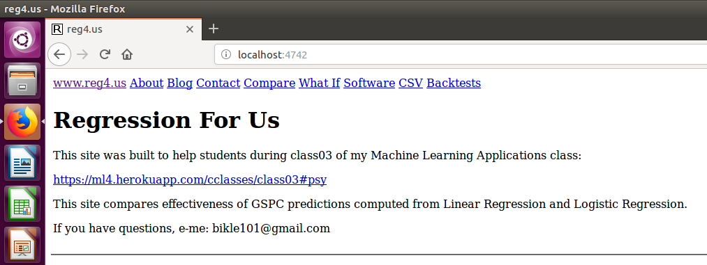

# README

I should finish README.md

I should write installation instructions.

I should write operation instructions.

I should write some manual tests.

I should write some rspec tests.

I should study warnings sent from heroku during deployment.

I run this repo on both my laptop and on Heroku.

I deployed this repo to my laptop with the steps listed below:

* I installed Virtualbox software which I downloaded from this URL:
* https://www.virtualbox.org/wiki/Downloads
* I downloaded and imported an Ubuntu 16 appliance [ub16_2018_0206.ova]: 
* https://drive.google.com/file/d/10p1W7kqzxE69jODhUzcb-qi-osN4htO-
* After import I logged into the ann account on the appliance with passwd: "a"
* I used a shell command to create an account named reg4us:
```
sudo useradd -m -s /bin/bash -G sudo reg4us
sudo passwd reg4us
```
* I logged out of the ann account.
* I logged into the reg4us account.
* I used shell commands to install Anaconda Python:
```
cd ~reg4us
echo 'export PATH=${HOME}/anaconda3/bin:$PATH' >> ~reg4us/.bashrc
wget https://repo.continuum.io/archive/Anaconda3-4.2.0-Linux-x86_64.sh
bash Anaconda3-4.2.0-Linux-x86_64.sh -b
mv ~reg4us/anaconda3/bin/curl ~reg4us/anaconda3/bin/curl_ana
```
* I used shell commands to install Rails:
```
cd ~reg4us
cp ~ann/.gitconfig ~reg4us/
wget ml4.herokuapp.com/.gemrc
echo 'export PATH="${HOME}/.rbenv/bin:$PATH"' >> ~reg4us/.bashrc
echo 'eval "$(rbenv init -)"' >> ~reg4us/.bashrc
git clone https://github.com/rbenv/rbenv.git      .rbenv
git clone https://github.com/rbenv/ruby-build.git .rbenv/plugins/ruby-build
bash
rbenv install 2.5.3
rbenv global  2.5.3
gem install rails -v 5.2.2
```
* I cloned the reg4us repo:
```
cd ~reg4us
git clone https://github.com/danbikle/reg4us
```
* I called bundler:
```
cd ~reg4us/reg4us
bundle
```
* I started the local webserver:
```
~reg4us/reg4us/script/railss.bash
```
* I loaded the home page from the webserver into my browser:
```
localhost:4742
```

